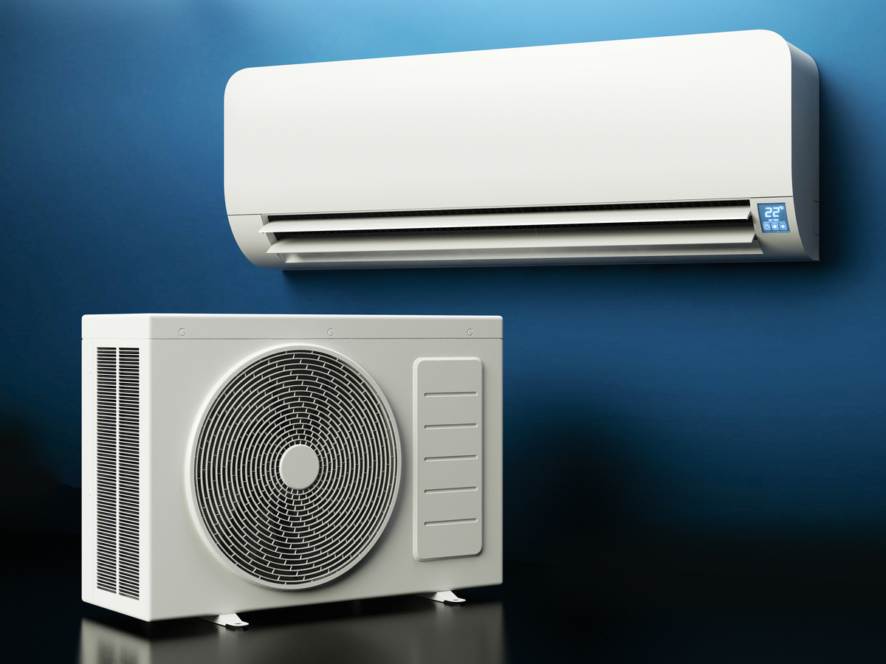
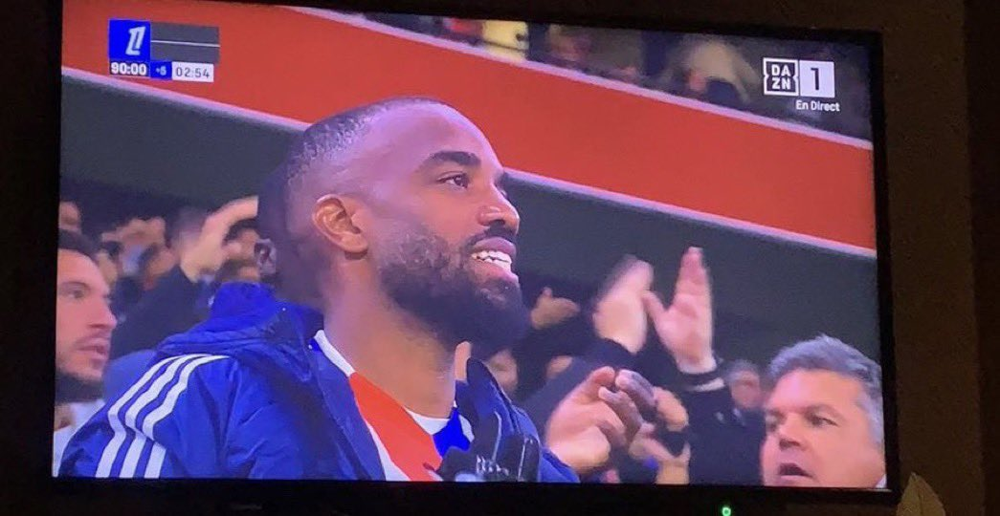
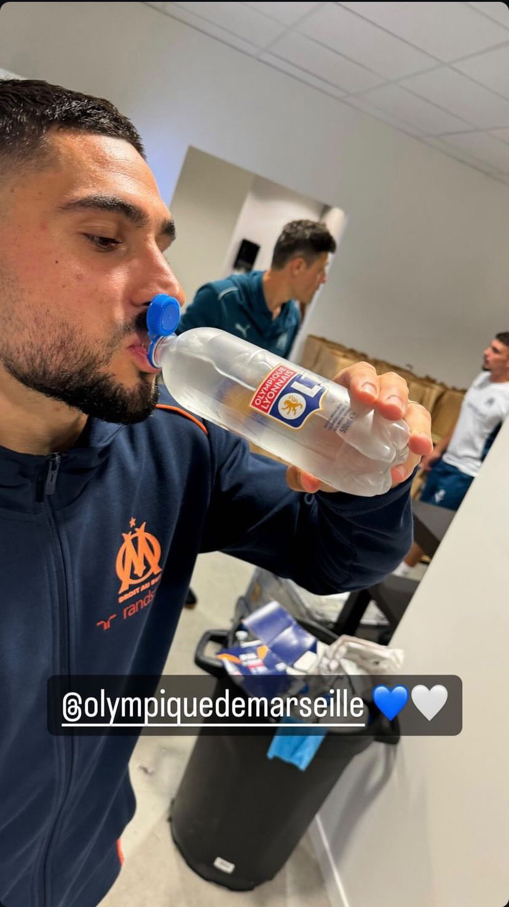

<!-- Text can be **bold**, _italic_, or ~~strikethrough~~.

[Link to another page](./another-page.html).

There should be whitespace between paragraphs.

There should be whitespace between paragraphs. We recommend including a README, or a file with information about your project. -->

# Qu'est ce qu'une climatisation ?

Une climatisation sert à rafraîchir l'air ambiant d'une pièce. Elle permet de réguler la température et l'humidité de l'air. Elle peut être utilisée pour refroidir une pièce en été ou pour chauffer une pièce en hiver. Elle peut également être utilisée pour purifier l'air en filtrant les particules de poussière, de pollen et de pollution.

## Maintenant, qu'est-ce qu'est VRAIMENT une climatisation ?

<!-- > This is a blockquote following a header.
>
> When something is important enough, you do it even if the odds are not in your favor. -->

L'art de la climatisation prend un tout autre tournant et une tout autre signification lorsqu'il s'agit du monde du sport. En effet, se faire "climatiser" revient à se faire refroidir par un adversaire, que ça soit par son niveau de jeu ou par son attitude. 

### Mettons nous en situation.

Voici une clim qui fait mal, très mal.

Eder est un joueur de football portugais qui a marqué le but de la victoire lors de la finale de l'Euro 2016. Il a marqué ce but à la 109ème minute de jeu, en prolongation, face à la France. 

### Et voici une clim qui fait un peu plus beaucoup moins mal.

> Le 22 Septembre 2024, l'Olympique Lyonnais reçoit l'Olympique de Marseille pour le compte du premier Olympico de la saison. Lyon est à domicile et Marseille écope d'un carton rouge pour Leonardo Balerdi dès la 5ème minute de jeu. Les marseillais doivent donc jouer le match complet à 10 contre 11 et réussissent à tenir le score jusqu'à la 53ème minute.

> C'est à ce moment là que le climatiseur s'est mis en route. L'Om revient au score 10 minutes plus tard, toujours à 10 contre 11. Les lyonnais sont dépassés et encaissent un deuxième but à la 82ème minute. Lyon revient au score à la 93ème minute et pense s'en sortir sur ce match nul.

> Sur un contre à la 95ème minute de jeu, Jonhatan Rowe fait s'imposer l'OM sur le score de 3-2. Les lyonnais sont abattus et les marseillais exultent.

Afin de conclure la clim dans les règles de l'art, merci de bien vouloir applaudir Neal Maupay pour la plus grosse photo clim de l'année 2024 :

### Conclusion

La climatisation est un art qui peut être utilisé dans de nombreux domaines. Mais s'il vous plaît, ne croyez pas avoir gagné avant la fin du match.